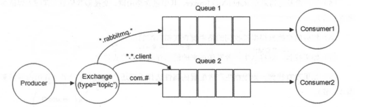

## 1. 概览

RabbitMQ 整体上是一个生产者与消费者模型，主要负责接收、存储和转发消息。RabbitMQ 模型更像是一种交换机模型。

生产者的消息不会直接发送到Queue上，而是先发送到Exchange，经过Exchange转到符合条件的Queue上。生产者发送数据的时候要携带一个Routing Key，Queue绑定到Exchange的时候应该绑定一个Bingding Key。消息通过Routing Key与Binding Key匹配规则找出对应的Queue，并发送给消费者。

## 2. 生产者(Producer)与消费者(Consumer)

- 生产者：生产消息的一方，生产消息，发送到MQ。
- 消费者：处理消息的一方，处理收到的MQ消息。

消息一般由 2 部分组成：**消息头** （或者说是标签 Label）和 **消息体** 。消息体也可以称为 payLoad ,消息体是不透明的，而消息头则由一系列的可选属性组成，这些属性包括 **routing-key（路由键）**、**priority（相对于其他消息的优先权）**、**delivery-mode（指出该消息可能需要持久性存储）**等。生产者把消息交由 RabbitMQ 后，RabbitMQ 会根据消息头把消息发送给感兴趣的 Consumer(消费者)。

## 3. Exchange(交换器)

在RabbitMQ中，消息不能直接发送到队列中，而是要先发送到Exchange中，通过Exchange将我们的消息发送到合适的队列(通过Exchange Type 和 Routing Key 与Binding Key的匹配规则)。

### 3.1 Exchange四种类型

direct(默认)，fanout, topic, 和 headers.

#### fanout

这个模式非常简单，不会进行Routing Key等过滤，所以速度是最快的，直接将消息发送到绑定到该Exchange的所有队列。该模式常用来做广播消息。

#### direct

Queue绑定到Exchange的时候需要设置一个Binding Key，生产者投递消息的时候需要传递一个Routing Key，如果这两个值完全相等，则发送到绑定这个Exchange下面的所有Queue。

如上图，Exchange类型为direct，Routing Key为warning会发送到Queue1和Queue2，Routing Key为info和dubug被发送到Queue2。

direct 类型常用在处理有优先级的任务，根据任务的优先级把消息发送到对应的队列，这样可以指派更多的资源去处理高优先级的队列。

#### topic

direct严格的匹配方式在很多情况下不能满足实际业务的需求。topic类型的交换器在匹配规则上进行了扩展，将消息路由到 BindingKey 和 RoutingKey 相匹配的队列中，按照一定的规则进行匹配。

- 用符号"."对Routing Key和Bingding Key词语进行分割。如：com.rabbitmq.client，这就是3个词。
- Bingding Key有两个特殊字符，`*`和`#`用于做模糊匹配，其中`*`用于匹配一个单词，`#`用于匹配多个单词(可以是零个)。

- 路由键为 `com.rabbitmq.client` 的消息会路由到Queue1与Queue2。
- 路由键为 `com.hidden.client` 的消息会路由到Queue2。
- 路由键为 `com.hidden.demo` 的消息会路由到Queue2。
- 路由键为 `java.rabbitmq.demo` 的消息会路由到Queue1。
- 路由键为 `java.util.concurrent` 的消息将会被丢弃或者返回给生产者（需要设置 `mandatory 参数`），因为它没有匹配任何路由键。

#### headers（不推荐）

headers 传输时是以键值对的形式，headers交换器不依赖于路由键的匹配规则来路由消息，而是**根据发送的消息内容中的 headers 属性进行匹配**。在绑定队列和交换器时指定一组键值对，当发送消息到交换器时，RabbitMQ会获取到该消息的 headers（也是一个键值对的形式)，**对比其中的headers键值对是否完全匹配队列和交换器绑定时指定的键值对，如果完全匹配则消息会路由到该队列，否则不会路由到该队列**。headers 类型的交换器性能会很差，而且也不实用，基本上不会看到它的存在。

如上图：Headers的键值对完全匹配的是key1与value1，所以路由到Queue1.

## 4. Queue

**Queue(消息队列)** 用来保存消息直到发送给消费者。它是消息的容器，也是消息的终点。一个消息可投入一个或多个队列。消息一直在队列里面，等待消费者连接到这个队列将其取走。

**RabbitMQ** 中消息只能存储在 **队列** 中，这一点和 **Kafka** 这种消息中间件相反。Kafka 将消息存储在 **topic（主题）** 这个逻辑层面，而相对应的队列逻辑只是topic实际存储文件中的位移标识。 RabbitMQ 的生产者生产消息并最终投递到队列中，消费者可以从队列中获取消息并消费。

**多个消费者可以订阅同一个队列**，这时队列中的消息会被平均分摊（Round-Robin，即轮询）给多个消费者进行处理，而不是每个消费者都收到所有的消息并处理，这样避免消息被重复消费。

**RabbitMQ** 不支持队列层面的广播消费,如果有广播消费的需求，需要在其上进行二次开发,这样会很麻烦，不建议这样做。

## 5. Broker（消息中间件的服务节点）

对于 RabbitMQ 来说，一个 RabbitMQ Broker 可以简单地看作一个 RabbitMQ 服务节点，或者RabbitMQ服务实例。大多数情况下也可以将一个 RabbitMQ Broker 看作一台 RabbitMQ 服务器。

下图展示了生产者将消息存入 RabbitMQ Broker,以及消费者从Broker中消费数据的整个流程。

参考链接：
- [RabbitMQ入门看这一篇就够了](https://github.com/Snailclimb/JavaGuide/blob/master/docs/system-design/distributed-system/message-queue/RabbitMQ%E5%85%A5%E9%97%A8%E7%9C%8B%E8%BF%99%E4%B8%80%E7%AF%87%E5%B0%B1%E5%A4%9F%E4%BA%86.md)